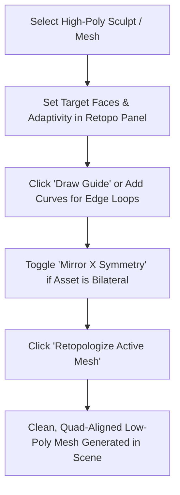

# InstantMeshes 2026 - Blender Plugin & Python API

This document describes how to use the InstantMeshes 2026 retopology engine directly inside **Blender (3.x, 4.x, and 5.x LTS)** with interactive topology flow control and target poly counts.

---

## Key Features

1. **Exact Target Face Count**:
   - Set the desired quad polygon budget directly from Blender's 3D Viewport sidebar (`Retopo` tab).
2. **Curvature-Adaptive Sizing**:
   - The **Curvature Adaptivity** slider (`0.0` to `1.0`) intelligently allocates smaller polygons to high-curvature areas (e.g. eyes, ears, nostrils, fingers) and larger polygons to flat areas (e.g. torso, forehead), dramatically improving shape preservation at low poly counts.
3. **Contour & Topology Flow Guidance**:
   - Draw curves or 3D Viewport Annotations directly over your sculpt.
   - Click **Draw Guide** in the panel to activate the annotation brush directly on the surface.
   - Any curve object selected or named `Contour*`, or any stroke drawn with the Annotate tool, acts as a hard edge-loop or orientation guide constraint, forcing quad edge loops to follow your anatomical contours.
4. **Bilateral Mirror Symmetry (X-Axis)**:
   - Check **Mirror X Symmetry** in the sidebar: contours drawn on one side of a character (eyes, mouth, limb loops) are automatically mirrored and constrained symmetrically across $X=0$.
5. **Singularity Regularization (QuadriFlow-inspired)**:
   - Eliminates spiral loops and irregular valence poles by cancelling adjacent dipole singularities (+1/4 and -1/4 pairs).
6. **Direct In-Memory Execution**:
   - High-performance `pybind11` C++ module passes NumPy vertex and face arrays directly between Blender and C++ without slow disk I/O.

---

## Installation & Setup

### Option 1: Using the Compiled Python Extension (`pyretopo`)

1. Build the Python extension using CMake:
   ```bash
   cd python
   mkdir build && cd build
   cmake .. -G "Visual Studio 17 2022" -A x64
   cmake --build . --config Release
   ```
2. Copy the resulting `pyretopo.*.pyd` file into Blender's Python `site-packages` directory:
   - E.g., `C:\Program Files\Blender Foundation\Blender 4.2\4.2\python\lib\site-packages\`
3. Install the add-on:
   - In Blender, open `Preferences > Add-ons > Install...`
   - Select `addon/retopo_blender.py` and enable **InstantMeshes2026 Retopology**.

### Option 2: Using the Headless CLI Fallback

If you haven't compiled the Python extension, the add-on automatically falls back to invoking `InstantMeshes2026CLI.exe` in the background via temporary files. Ensure `InstantMeshes2026CLI.exe` is placed in your system `PATH`.

---

## Blender Workflow: Step-by-Step



1. **Select Mesh**: In Object Mode, select your high-poly sculpt.
2. **Open Panel**: Press `N` in the 3D Viewport and switch to the `Retopo` tab.
3. **Adjust Target Parameters**:
   - **Target Faces**: Enter your exact desired quad budget (e.g. `2500` for a game-ready character head).
   - **Curvature Adaptivity**: Set between `0.2` and `0.5` for character meshes with fine details.
4. **Draw Flow Contours (Optional but Recommended)**:
   - Click **Draw Guide**: sketch edge loops directly on the model surface (around the eyes, mouth, nose, joints).
   - Or add a Curve (`Shift + A > Curve > Bezier`), rename it `Contour_Eyes`, and snap vertices to the surface.
   - Check **Mirror X Symmetry** if your model is bilateral (it will automatically remesh both sides with symmetric flow).
5. **Retopologize**:
   - Click **Retopologize Active Mesh**.
   - A new object `[ObjectName]_Retopo` will be created in your scene with clean quad topology.
